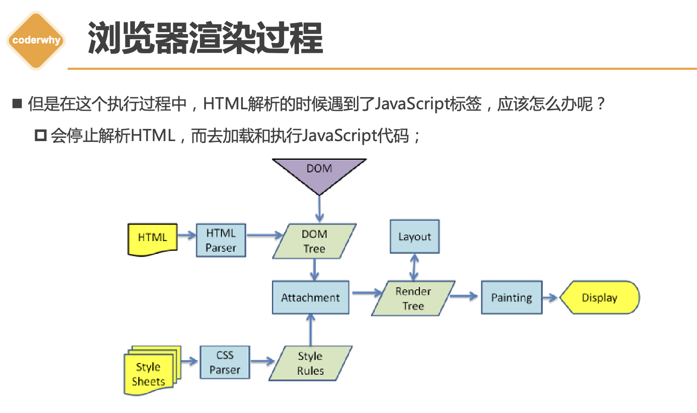
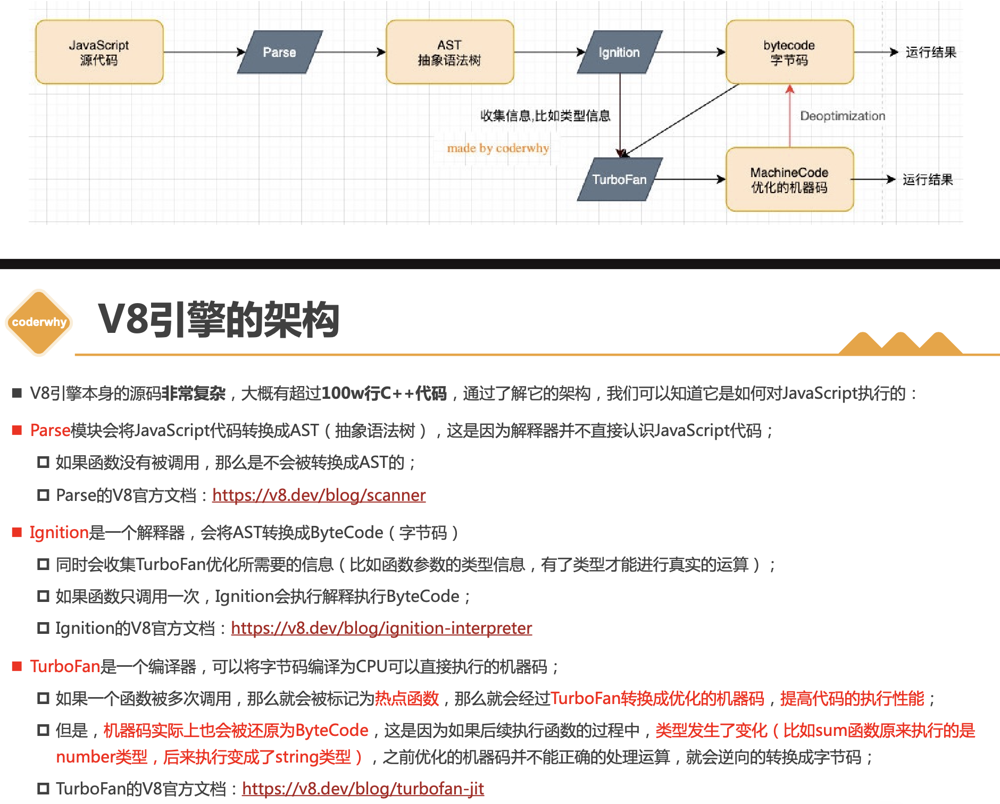
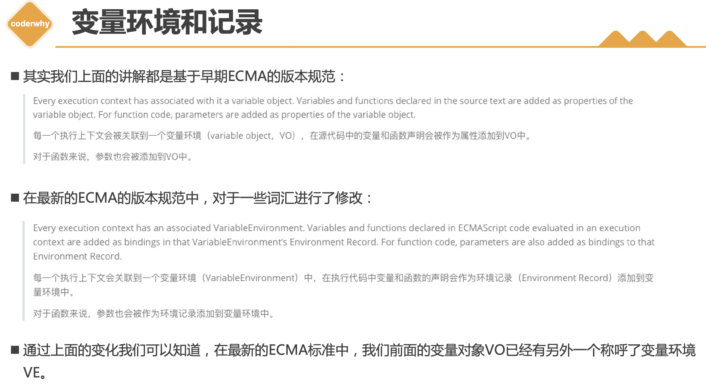

# 复习及面试二刷

[toc]

## 1. 浏览器渲染过程

## 2. V8引擎原理

js代码=>词法分析/语法分析=>抽象语法树=>转换=>字节码=>机器指令

抽象语法树在线解析网站<https://astexplorer.net/>

## 3. ES5 执行过程及作用域

作用域考察点：

- 作用域提升底层原理 GO ECS VO GEC
- 函数执行上下文 FEC AO
  - 作用域链 scope chain: AO + parentScope
  - 函数的作用域在编译的时候就确定了，与调用位置无关
  - 解析过程中return无效，其后面的代码正常解析
  - var a = b = 2 => var a = 2; window.b = 2

## 4. 内存管理

- 内存管理生命周期
  - 第一步：申请内存
  - 第二步：使用分配的内存
  - 第三部：不需要使用时对其进行释放
- js自动内存管理（第二步）
- 定义变量时分配内存
  - 基本数据类型-栈空间
  - 复杂数据类型-堆空间
- GC垃圾回收（Garbage Collection）
  - 引用计数。弊端：循环引用
  - 标记清除。从根对象可达

## 5. 高阶函数

函数在js中是一等公民，可以作为函数的参数和返回值

[数组高阶方法](https://developer.mozilla.org/zh-CN/docs/Web/JavaScript/Reference/Global_Objects/Array)

- filter
  - 返回一个新的数组，回调函数的返回值true会被加入到新数组，false则不会
- map
  - 映射
- forEach
  - 迭代
- reduce
  - 统计、求和
- find
- findIndex
  
## 6. [闭包](https://developer.mozilla.org/zh-CN/docs/Web/JavaScript/Closures)

考察点：

- 什么是闭包
- 闭包的内存泄漏
- 闭包的作用

## 7. this 的指向问题 [mdn](https://developer.mozilla.org/zh-CN/docs/Web/JavaScript/Reference/Operators/this) [coderwhy](https://mp.weixin.qq.com/s/hYm0JgBI25grNG_2sCRlTA)

this的指向和函数的定义位置无关，和函数调用方式有关 **重点看面试题，再找几个面试题看看**

- 全局
  - 浏览器：window
  - node：{ } 空对象
- 默认绑定
  - 独立函数调用，无调用主体，指向window
  - ~~闭包中的函数调动都是指向this~~ **错误**
- 隐式绑定
  - 对象内部必须有对函数的引用，否则就会报错
  - object会被js引擎绑定到函数的this中
- 显式绑定
  - call
  - apply
  - bind
- new绑定
  - this指向构造器创建的对象
- 特殊情况下this的指向问题
  - setTimeout => window
  - 元素的点击事件 => 元素本身
  - 数组的高阶函数 => window

优先级

- 默认绑定优先级最低
- 显示绑定优先级高于隐式绑定
- new优先级高于隐式绑定
- new优先级大于显式绑定

规则之外

- 忽略显式绑定： apply bind call 中 this 绑定为 null 和 undefined 就会绑定，进而绑定window
- 见 间接函数引用.js
- 箭头函数不绑定this arguments, 并且不能作为构造函数使用

## 8. 手写apply call bind

### call实现思路

- 首先或获取调用call的函数 `const fn = this` 隐式绑定
- 绑定thisArg `thisArg.fn = fn; thisArg.fn(); delete thisArg.fn` => 但是还需要把thisArg转换为对象类型 => `thisArg = Object(thisArg)`
- 传参 剩余参数
- 返回值

### apply实现思路同上

- 需增加考虑第二个参数是否传入

### bind实现思路基本相同

- 需考虑两个参数的拼接
- 及返回函数

## 9. arguments

- [mdn参考文档](https://developer.mozilla.org/zh-CN/docs/Web/JavaScript/Reference/Functions/arguments)
- ES6+推荐使用剩余参数`rest parameters`
- 箭头函数中没有`arguemnts`
- 浏览器中全局没有arguments node中有arguments

## 10. 类数组

类数组 `arrayLike`

length属性 索引值获取对应参数 callee获取当前函数

类数组转换为数组

- 遍历 `for 循环`
- `Array.prototype.slice.call(arguments)` call绑定this 与slice的实现方式有关
  - 也可以写做`[].slice.call(arguments)`
- `Array.from(arguments)`
- 展开运算符`[...argumets]`
- `push.call()`

## 11. 纯函数

编程中优先使用纯函数(Pure Function)

- 函数在相同的输入始终产生相同的输出
- 函数的输出和输入值以外的其他隐藏信息或状态无关，也和I/O设备产生的外部输出无关
- 函数不可能有语义上的可观察的[副作用](https://zh.wikipedia.org/wiki/%E5%89%AF%E4%BD%9C%E7%94%A8_(%E8%AE%A1%E7%AE%97%E6%9C%BA%E7%A7%91%E5%AD%A6))，诸如触发事件，是设备输入输出或更改输出值以外物件的内容
  - slice就是一个纯函数
  - splice不是纯函数，会修改原数组对象本身

## 12. 柯里化Currying

是把接收多个参数的函数，变成接受一个单一参数（最初函数的第一个参数）的函数，并且返回接受余下的参
数，而且返回结果的新函数的技术；

使用场景

- 单一职责原则
- 逻辑复用

手写思路

- 传入一个函数，返回柯里化后的函数
- 对比柯里化后传入的参数个数和原函数的个数
  - 柯里化大于等于原函数：直接aplly执行
  - 否则继续回调，知道达到上述条件

## 13. 组合函数

手写思路

- 边界条件判断
  - 函数剩余参数的长度为0
  - 传入非函数
- 手动执行第一个函数，获取当前结果
- 遍历数组，每次都将上一次的执行结果传入下个函数中执行
  - 注意while循环的边界条件 `++i<fnArgs.length`

## 14. with

产生作作用域的途径

- 全局
- 函数
- with

## 15. 严格模式

"use strict" 是一种具有限制性的JavaScript模式，从而使代码隐式的脱离了”懒散（sloppy）模式“

开启严格模式的两种方式

- 全局
- 函数

严格模式下的限制

1. 无法意外的创建全局变量
2. 严格模式会使引起静默失败(silently fail,注:不报错也没有任何效果)的赋值操作抛出异常 `NaN赋值` `configrable` `true.x = ...`
3. 严格模式下试图删除不可删除的属性
4. 严格模式不允许函数参数有相同的名称
5. 不允许0的八进制语法
6. 在严格模式下，不允许使用with
7. 在严格模式下，eval不再为上层引用变量
8. 严格模式下，this绑定不会默认转成对象

## 16. 面向对象

数据属性描述符

- configurable 表示属性是否可以通过delete删除属性，是否可以修改它的特性，或者是否可以将它修改为存取属性描述符
- enumerable 是否可枚举
- value 值
- writable 是够可以写入（修改值）

存取属性描述符（访问器）**用来隐藏私有属性 截获getter setter**

- configurable 表示属性是否可以通过delete删除属性，是否可以修改它的特性，或者是否可以将它修改为数据属性描述符
- enumerable
- get
- set
