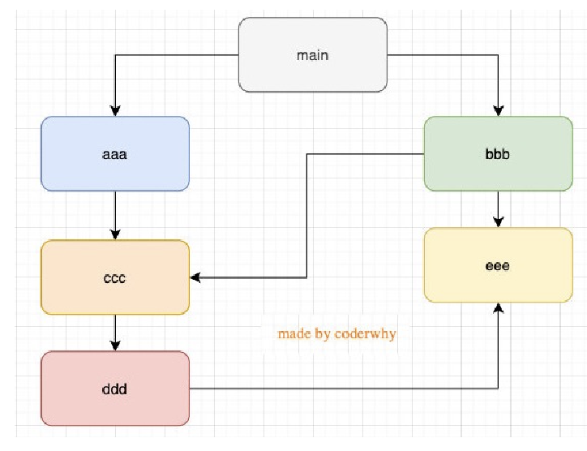

# 复习及面试二刷

[toc]

## 1. 浏览器渲染过程


## 2. V8引擎原理


js代码=>词法分析/语法分析=>抽象语法树=>转换=>字节码=>机器指令

抽象语法树在线解析网站<https://astexplorer.net/>

## 3. ES5 执行过程及作用域

作用域考察点：

- 作用域提升底层原理 GO ECS VO GEC
- 函数执行上下文 FEC AO
  - 作用域链 scope chain: AO + parentScope
  - 函数的作用域在编译的时候就确定了，与调用位置无关
  - 解析过程中return无效，其后面的代码正常解析
  - var a = b = 2 => var a = 2; window.b = 2


## 4. 内存管理

- 内存管理生命周期
  - 第一步：申请内存
  - 第二步：使用分配的内存
  - 第三部：不需要使用时对其进行释放
- js自动内存管理(第二步)
- 定义变量时分配内存
  - 基本数据类型-栈空间
  - 复杂数据类型-堆空间
- GC垃圾回收(Garbage Collection)
  - 引用计数。弊端：循环引用
  - 标记清除。从根对象可达

## 5. 高阶函数

函数在js中是一等公民，可以作为函数的参数和返回值

[数组高阶方法](https://developer.mozilla.org/zh-CN/docs/Web/JavaScript/Reference/Global_Objects/Array)

- filter
  - 返回一个新的数组，回调函数的返回值true会被加入到新数组，false则不会
- map
  - 映射
- forEach
  - 迭代
- reduce
  - 统计、求和
- find
- findIndex
  
## 6. [闭包](https://developer.mozilla.org/zh-CN/docs/Web/JavaScript/Closures)

考察点：

- 什么是闭包
- 闭包的内存泄漏
- 闭包的作用

## 7. this 的指向问题(重点) [mdn](https://developer.mozilla.org/zh-CN/docs/Web/JavaScript/Reference/Operators/this) [coderwhy](https://mp.weixin.qq.com/s/hYm0JgBI25grNG_2sCRlTA)

this的指向和函数的定义位置无关，和函数调用方式有关 **重点看面试题，再找几个面试题看看**

- 全局
  - 浏览器：window
  - node：{ } 空对象
- 默认绑定
  - 独立函数调用，无调用主体，指向window
  - ~~闭包中的函数调动都是指向this~~ **错误**
- 隐式绑定
  - 对象内部必须有对函数的引用，否则就会报错
  - object会被js引擎绑定到函数的this中
- 显式绑定
  - call
  - apply
  - bind
- new绑定
  - this指向构造器创建的对象
- 特殊情况下this的指向问题
  - setTimeout => window
  - 元素的点击事件 => 元素本身
  - 数组的高阶函数 => window

优先级

- 默认绑定优先级最低
- 显示绑定优先级高于隐式绑定
- new优先级高于隐式绑定
- new优先级大于显式绑定

规则之外

- 忽略显式绑定： apply bind call 中 this 绑定为 null 和 undefined 就会绑定，进而绑定window
- 见 间接函数引用.js
- 箭头函数不绑定this arguments, 并且不能作为构造函数使用

## 8. 手写apply call bind

### call实现思路

- 首先或获取调用call的函数 `const fn = this` 隐式绑定
- 绑定thisArg `thisArg.fn = fn; thisArg.fn(); delete thisArg.fn` => 但是还需要把thisArg转换为对象类型 => `thisArg = Object(thisArg)`
- 传参 剩余参数
- 返回值

### apply实现思路同上

- 需增加考虑第二个参数是否传入

### bind实现思路基本相同

- 需考虑两个参数的拼接
- 及返回函数

## 9. arguments

- [mdn参考文档](https://developer.mozilla.org/zh-CN/docs/Web/JavaScript/Reference/Functions/arguments)
- ES6+推荐使用剩余参数`rest parameters`
- 箭头函数中没有`arguemnts`
- 浏览器中全局没有arguments node中有arguments

## 10. 类数组

类数组 `arrayLike`

length属性 索引值获取对应参数 callee获取当前函数

类数组转换为数组

- 遍历 `for 循环`
- `Array.prototype.slice.call(arguments)` call绑定this 与slice的实现方式有关
  - 也可以写做`[].slice.call(arguments)`
- `Array.from(arguments)`
- 展开运算符`[...argumets]`
- `push.call()`

## 11. 纯函数

编程中优先使用纯函数(Pure Function)

- 函数在相同的输入始终产生相同的输出
- 函数的输出和输入值以外的其他隐藏信息或状态无关，也和I/O设备产生的外部输出无关
- 函数不可能有语义上的可观察的[副作用](https://zh.wikipedia.org/wiki/%E5%89%AF%E4%BD%9C%E7%94%A8_(%E8%AE%A1%E7%AE%97%E6%9C%BA%E7%A7%91%E5%AD%A6))，诸如触发事件，是设备输入输出或更改输出值以外物件的内容
  - slice就是一个纯函数
  - splice不是纯函数，会修改原数组对象本身

## 12. 柯里化Currying

是把接收多个参数的函数，变成接受一个单一参数(最初函数的第一个参数)的函数，并且返回接受余下的参
数，而且返回结果的新函数的技术；

使用场景

- 单一职责原则
- 逻辑复用

手写思路

- 传入一个函数，返回柯里化后的函数
- 对比柯里化后传入的参数个数和原函数的个数
  - 柯里化大于等于原函数：直接apply执行
  - 否则继续回调，知道达到上述条件

## 13. 组合函数

手写思路

- 边界条件判断
  - 函数剩余参数的长度为0
  - 传入非函数
- 手动执行第一个函数，获取当前结果
- 遍历数组，每次都将上一次的执行结果传入下个函数中执行
  - 注意while循环的边界条件 `++i < fnArgs.length`

## 14. with

产生作作用域的途径

- 全局
- 函数
- with

## 15. [严格模式](https://developer.mozilla.org/zh-CN/docs/Web/JavaScript/Reference/Strict_mode)

"use strict" 是一种具有限制性的JavaScript模式，从而使代码隐式的脱离了”懒散(sloppy)模式“

开启严格模式的两种方式

- 全局
- 函数

严格模式下的限制

1. 无法意外的创建全局变量
2. 严格模式会使引起静默失败(silently fail,注:不报错也没有任何效果)的赋值操作抛出异常 `NaN赋值` `configrable` `true.x = ...`
3. 严格模式下试图删除不可删除的属性
4. 严格模式不允许函数参数有相同的名称
5. 不允许0的八进制语法
6. 在严格模式下，不允许使用with
7. 在严格模式下，eval不再为上层引用变量
8. 严格模式下，this绑定不会默认转成对象

## 16. 面向对象

数据属性描述符

- configurable 表示属性是否可以通过delete删除属性，是否可以修改它的特性，或者是否可以将它修改为存取属性描述符
- enumerable 是否可枚举
- value 值
- writable 是够可以写入(修改值)

存取属性描述符(访问器)**用来隐藏私有属性 截获getter setter**

- configurable 表示属性是否可以通过delete删除属性，是否可以修改它的特性，或者是否可以将它修改为数据属性描述符
- enumerable
- get
- set

`Object.defineProperty(obj, prop, descriptor)` `Object.defineProperties(obj, prop)` `getOwnPropertyDescriptor` `getOwnPropertyDescriptors` `preventExtensions` `seal` `frezze`

## 17. 构造函数

缺点

- 多次执行构造函数多次创建函数，浪费内存及性能

new执行过程

1. 创建空对象
2. 对象的隐式原型被赋值为构造函数的显式原型
3. this指向空对象
4. 执行代码
5. 返回对象

## 18. **原型**(重点)

对象里面的隐式原型 `__proto__` `Object.getPrototypeOf()`

函数有显式原型(函数作为对象也有隐式原型)

- 重写`foo.prototype`
  
  ```js
    foo.prototype = {
      name: 'zhang',
      age: 17
    }
    
    Object.defineProperty(foo.prototype, 'constructor', {
      enumerable: false,
      configrable: true,
      value: foo,
      writable: true
    })
  ```

原型链 **重点难点：原型继承关系**

- 对象中查找属性触发getter操作
  - 1. 当前对象上面查找
  - 2. 没有的话就去原型(链)`__proto__`上面查找
  - 3. 直到找到顶层原型 `Object.prototype`
    - 原型属性指向null
    - 有很多默认属性和方法

## 19. 继承

面向对象三(四)大特性

- 封装：属性和方法封装到类中
- 继承：多态前提，代码复用
- 多态：(对同一数据类型进行不同操作有不同的形态)
  - 必须有继承
  - 必须有重写
  - 必须有父类引用指向子类对象
- (抽象)

继承的方案(重点)

- 原型链实现继承
  - 1. 定义父类构造函数
  - 2. 父类构造函数原型添加方法
  - 3. 定义子类构造函数
  - 4. 子类构造函数原型指向父类创建出来的对象
  - 5. 子类原型上添加内容
  - 6. 创建子类对象
  - 弊端: 有些属性不显示；原型中的属性共享，方法会有问题；不能传参数
- 借用构造函数继承
  - 解决以上弊端 => call调用父类构造函数传参
  - 存在弊端：父类构造函数至少执行两次；原型对象存在多余属性
- 原型式继承(对象)
  - 见 13_原型链和继承/10_继承_原型式继承-对象.js
  - `setPropertypeOf(proto)` `Object.create(proto)` `function fn (){}; fn.prototype = objParam;return new Fn();`
- 寄生式继承
  - 原型式继承 + 工程函数
- 寄生组合式继承
  - `Student.prototype = Object.create(Person.prototype)`
  - 重构 `constructor`

## 20. 原型补充方法

- `hasOwnProperty` 内部
- `in` 如果指定的属性在指定的对象或其原型链中，则in 运算符返回true
- `for in` 内部和原型
- `instanceof` 构造函数的原型是否出现在某个实例的原型链上
- `isPrototypeOf` 某个对象是否出现在某个实例的原型链上

## 21. class

class

- constructor
- 普通方法(放在类的原型中)
- 访问器方法 拦截
- 静态方法 通过类名访问

继承(js只支持单继承)

- super(para1[, para2...])
- 子类对父类(静态)方法的重写(superType.super())

babel编译

- **难点**理解原理

补充

- 创建类继承自内建 扩展方法
- mixin 借助函数实现mixin

## 22. ES6~ES11

详细可见fe-interview/js/03-ES6.md

## 23. [Proxy](https://developer.mozilla.org/zh-CN/docs/Web/JavaScript/Reference/Global_Objects/Proxy/Proxy/get)

### 监听对象的方法

- defineProperty
  - 设计初衷是设置对象属性
  - 无法对新增删除属性进行监听
- Proxy(类)
  - 语法：`new Proxy(target, handler)`
  - handler 捕获器
    - 13 个，包含两个函数对象的捕获器

## 24. Reflect 反射

Reflect是对象([它和Object的区别](https://developer.mozilla.org/zh-CN/docs/Web/JavaScript/Reference/Global_Objects/Reflect/Comparing_Reflect_and_Object_methods))

## 25. **响应式**

手写思路

- 1. 封装响应式函数 `function watchFn(){ depend.addDepend(fn) }`
  - 1.1 将需要执行的函数放进一个数组中，属性发生变化时遍历数组执行函数 `depend.notify()`
    - 1.1.1 封装在一个类里面，每个属性对应一个响应式函数数组`class Depend{[], addDepend(), notify()}`
- 2. 自动收集依赖
  - 2.1 `const objProxy = new Proxy(obj, { get(){ }, set(){ 在这里面执行相应式函数 } })`
    - 上面的代码在obj对象中的任何一个属性都会执行
  - 2.2 依赖收集的管理
    - 思路：{ 属性变化 => 先找到Obj对象 => 找到Obj对象中的属性 => 响应式函数执行 }
    - 伪代码：weakMap{ obj => { map{ info1 => [fn1, fn2], info2 => [fn1, fn2] } } }
  - 2.3 封装获取depend的函数，根据上述思路
- 3. 在getter中收集依赖
  - 3.1 找到depend对象, Fn先执行一次`const deped = getDepend(target, key)`
- 4. 优化：
  - 4.1 数组 => new Set()
  - 4.2 getter内调用方法不传参
- 5. 创建响应式对象

## 26. Promise

### 创建

- `const promise = new Promise((resolve, reject)=>{ ... })` 传入的回调函数立即执行
- `promise.then(()=>{})` resolve的回调
- `promise.catch(()=>{})` reject的回调

### 状态

一旦确定不可更改

- pending 待定状态 执行executor
- fulfilled 已兑现状态 执行resolve
- rejected 已拒绝状态 执行reject

### 参数

- 值类型/对象类型
- Promise类型，当前Promise的状态由传入的Promise状态决定（相当于状态进行了移交）
- 传入一个对象，并且有实现then方法，那么会执行该then方法，并且根据 then方法的结果来决定Promise的状态（thenable）

### 对象方法

- `then`
  - 同一个Promise可以多次调用then方法（不是说链式调用）
  - then 回调函数有返回值，返回值也是Promise，故可以实现链式调用
    - 值类型和对象类型
    - Promise
    - thenable
- `catch`
  - 可以多次调用
  - 执行场景
    - `reject()` 回调
    - `throw new Error()` 回调
  - 书写位置
    - `new Promise().then(res=>{}, err=>{})`
    - `new Promise().then().catch()`
    - `new Promise().catch()`
  - 返回值
    - catch返回值还是调用then()
- `finally`
  - 无论executor是fulfilled还是rejected都会调用fianlly方法，finally方法没有参数

### 类方法

- `resolve` 对象转Promise的方法
  - 值类型
  - Promise
  - thenable
- `reject`
  - 无论传入什么样的值都没有区别
- `all` 所有的promise都是fulfilled返回值
  - Promise.all([]).then() 按照数组内元素顺序返回值结果
  - 只要有一个rejected状态就会执行reject()
- `allSettled` 所有promise都有结果，无论filfulled或者rejected，会调用then()，返回数组[{status:..., result(reason):...}, {...}]
- `race`
  - 第一个有结果的Promise
- `any`
  - 第一个filfulled；所有rejected执行完毕

### 手写

思路

- [propmise a+规范](https://promisesaplus.com/)
- 课件**21JSON序列化和浏览器BOM**

## 27. [迭代器](https://zh.wikipedia.org/wiki/%E8%BF%AD%E4%BB%A3%E5%99%A8)

迭代器是一个对象，符合迭代器协议

```js
const names = ["abc", "cba", "nba"]

let index = 0

const namesIterator = {
  next: function() {
    if (index < names.length) {
      return { done: false, value: names[index++] }
    } else {
      return { done: true, value: undefined }
    }
  }
}
```

可迭代对象是一个对象，符合可迭代协议

```js
const iterableObj = {
  names: ["abc", "cba", "nba"],
  [Symbol.iterator]: function() {
    let index = 0
    return {
      next: () => {
        if (index < this.names.length) {
          return { done: false, value: this.names[index++] }
        } else {
          return { done: true, value: undefined }
        }
      }
    }
  }
}
```

内置可迭代对象

- String
- Array
- Map
- Set
- arguments对象
- NodeList集合

## 28. 生成器

- 生成器函数`function* foo(){}`
- 可以通过`yield`控制代码执行流程
- 返回值是一个生成器（特殊的迭代器）

执行流程

- 遇到yield暂停执行，通过yield返回值
- 遇到return停止执行

其他方法

- `generator.next()`
- `generator.return()` 提前终止生成器代码执行
- `generator.throw()` 抛出异常

生成器替代迭代器

- yield
- yield*

## 29. async和await

### async

写法

```js
async function foo(){
  
}
```

异步函数的返回值是一个promise

抛出异常需捕获

### await

## 30. 事件循环

进程和线程的概念

- 进程：计算机已经运行的程序，是操作系统管理程序的一种方式
- 线程：操作系统能够运行调度的最小单位，通常情况下被包含在线程当中

main script 直接执行，回调函数加到队列中执行

### 浏览器环境

事件队列

- 宏任务队列
  - 定时器，ajax，DOM，UI Rendering
- 微任务队列
  - queueMicrotask，Promise.then()，MutationObserveAPI

重点：**宏任务执行前需保证微任务队列清空**

### Node环境

Node中时间循环不止是微任务队列和宏任务队列(按照下面的顺序执行)

- 微任务队列
  - next tick queue: *process.nextTick*
  - other queue: *Promise.then()*、*queueMicrotask*
- 宏任务队列
  - timer queue: *setTimeout* *setInterval*;
  - poll queue: *IO事件*;
  - check queue: *setImmediate*;
  - close queue: *close事件*;

```plaintext
   ┌───────────────────────────┐
┌─>│           timers          │
│  └─────────────┬─────────────┘
│  ┌─────────────┴─────────────┐
│  │     pending callbacks     │
│  └─────────────┬─────────────┘
│  ┌─────────────┴─────────────┐
│  │       idle, prepare       │
│  └─────────────┬─────────────┘      ┌───────────────┐
│  ┌─────────────┴─────────────┐      │   incoming:   │
│  │           poll            │<─────┤  connections, │
│  └─────────────┬─────────────┘      │   data, etc.  │
│  ┌─────────────┴─────────────┐      └───────────────┘
│  │           check           │
│  └─────────────┬─────────────┘
│  ┌─────────────┴─────────────┐
└──┤      close callbacks      │
   └───────────────────────────┘
```

## 31. 错误处理方案

直接抛出异常影响函数继续运行

- 可以throw任何类型，但一般throw对象
- 创建一个ErrorInfo类
  - `throw new ErrorInfo()`
- 内置`throw new Error('')`
  - 子类
    - TypeError
    - SyntaxError
    - RangeError

trycatch, 程序不终止

```js
try{
  ...
}catch([error]){
  ...
  alert(error.message)
}finally{
  ...
}
```

## 32. 模块化

### CommonJS

CommonJS加载代码是同步的

- module是当前模块的对象
  
  ```js
  // name.js
  const name = 'zhang';
  module.exports = {
    name
  }
  // main.js
  const { name } = require(./name.js)
  ```

- 原理源码

  ```js
  module.exports = {};
  exports = module.export;
  // 注意：最后到处的一定是module.export
  ```

  正确导出2

  ```js
  exports.name = 'zhang'
  ```

  错误导出

  ```js
  exports = {}
  ```

- require(X)查找规则
  - 1. X 核心模块
  - 2. X 路径
    - / 绝对路径根路径  ./ 相对路径
    - 2.1 有后缀名 直接查找
    - 2.2 无后缀名 直接查找 => .js => .json => .node => 文件夹
    - 2.3 X 作为目录，X目录下查找
      - index.js => index.json => index.node
  - 3. X 不是路径也不是核心模块
    - 3... 从当前文件目录所在 node_modules 中依次向上查找
  
- 加载细节
  - 模块在被第一次引入时，模块中的js代码会被运行一次
  - 模块多次引入有缓存
  - 循环引用加载顺序
    - 深度优先搜索(DFS, depth first search)

    

### AMD

### CMD

### ESModule

`<script scr="..." type="module"></script>`

导出方式

```js
// 导出声明语句
export const name = 'zhang'
// 集中导出
const name = 'zhang'
export {
  name
}
// 导出时起别名
export {
  name as xName
}
```

导入方式

```js
// 直接导入
import { name } from '../main.js'
// 导入时起别名
import { name as aName} from '../main.js'
// 将导出的所有内容放在一个标识符中
import * as x from 'main.js'
```

结合使用

```js
// index.js
// export {} from 'main.js'
// export * form 'main.js'
```

default用法

```js
// 默认导出只能有一个
export default foo
// or
export {
  name,
  foo as default
}
```

import函数

- 返回的结果是promise `import('./main.js').then(res => console.log('res'))`
- `import.meta` url属性 模块文件所在的文件夹

[原理](https://hacks.mozilla.org/2018/03/es-modules-a-cartoon-deep-dive/)

- 构建 construction 构建解析成为模块记录
  - fetch => parse(静态分析，不运行代码) => module record
- 实例化 instantiation
- 运行 evalution

Node(指定版本)中CommonJS和ESModule中可以实现相互调用

基于webpack开发环境CommonJS和ESModule可以相互引用

## 33. 包管理工具

### [npm](https://docs.npmjs.com/cli-documentation/cli)

- `npm rebuild` 重新构建
- `npm clean cache` 清除缓存

npx执行本地npm命令

### [yarn](https://yarnpkg.com/)

### [cnpm](https://npmmirror.com/)

### [pnpm](https://pnpm.io/zh/)

## 34. JSON

### 顶层编写要求：无注释

- 简单值

  ```json
  123
  ```

- 对象

  ```json
  {
    "name": "why",
  }
  ```

- 数组

### 序列化

- 对象转JSON格式字符串 `JSON.stringify(value, replacer?, space?)`
  - replacer 为数组，设置那些key进行转化
  - replacer 为回调函数，拦截
  - space 数字或者字符串类型
- JSON格式字符串转对象 `JSON.parse(value, reviver?(){})`
  - reviver 回调函数

### 利用JSON实现深拷贝

深拷贝-浅拷贝-引用赋值

- 引用赋值
- 浅拷贝
  - 解构
  - `Object.assign()`
- 深拷贝
  - `JSON.stringify(JSON.parse(object))` 简单的深拷贝
  - 不会处理函数 Symbol Set Map等

## 35. 浏览器存储

### localStorage 本地存储

- length 属性
- setItem 方法
- key 方法
- getItem 方法
- removeItem 方法
- clear()

### sessionStorage 会话存储

新的标签就是一个新的会话，sessionStorage不会保存

方法及属性同上

### indexedDB

事务型数据库 底层API

### cookie

常见属性

- 生命周期
  - expires
  - max-age
- 作用域
  - 默认 origin
  - Domain
- Path 主机下那些路径可以接受cookie

缺点

- 每次请求都会携带cookie
- 明文传输，存在一定安全风险
- 存在大小限制
- 客户端限制

## 36. BOM-DOM

### BOM 浏览器对象模型

- window
  - 全局对象
    - 大量 属性 方法 事件 以及从EventTarget继承的方法
  - 浏览器窗口对象
- location
  - assign() 有回退按捏
  - replace() 无回退按钮
  - reload() 重新加载
  - toString() href属性的只读方法
- history
- document

### DOM

DOM都支持EventTarget

DOM都支持Node

HTMLDocument常见方法和属性

[HTMLCollection](https://developer.mozilla.org/zh-CN/docs/Web/API/HTMLCollection) and [NodeList](https://developer.mozilla.org/zh-CN/docs/Web/API/NodeList)

Document

- 创建元素
  - document.createElement('div')
- 获取元素
  - getElementById
  - getElementByTagName
  - getElementByClassName
  - querySelectorAll
  - querySelector

Element

## 37. 事件冒泡

事件冒泡和事件捕获，同时存在时，先捕获，再冒泡

事件event的属性和方法

- preventDefault() 阻止默认行为
- stopPropogation() 阻止冒泡

## 38. 手写防抖函数

### 理解

- 事件触发时不会立即执行操作，而是会等待一定时间。
- 事件密集触发时，函数的执行会被频繁地推迟
- 只有等待一定时间也没有事件触发，才会真正的执行真正的响应函数

### 应用场景

- 频繁输入内容用来提及信息
- 频繁的点击按钮
- 监听浏览器的点击事件
- 用户缩放浏览器resize事件

### 手写防抖函数

## 39. 手写节流函数

### 认识

- 事件触发时会执行这个时间的响应函数
- 如果这个时间被频繁触发，那么节流函数会按照一定的频率来执行函数
- 不管这个中间会有多少次触发这个事件，执行函数的频率总是固定的

### 场景

- 监听页面的滚动事件
- 鼠标的移动事件
- 用户点击按钮操作
- 游戏中的一些设计

### 手写节流函数

### 防抖和节流的区别，各自的应用场景

防抖和节流都用于处理频繁触发的操作，优化操作体验。

触发频率

- 防抖，不固定
- 节流，固定

场景

- 防抖，结果式，即一次调用即可
- 节流，过程式，即需要持续一个过程，一次不够

## 40. 手写深拷贝函数

## 41. 手写事件总线
